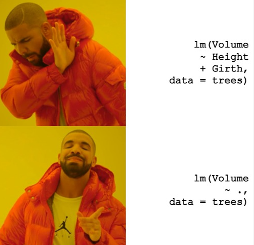
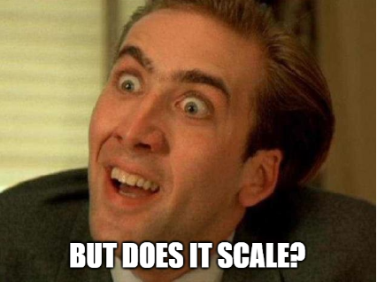

```{r setup-03, include=F, echo=F}
knitr::opts_chunk$set(
  # collapse = TRUE
  warning = FALSE,
  message = FALSE
)
library(details)
```

# A review of R modeling fundamentals

**Learning objectives:**

-   Specify model terms using the **R formula syntax.**
-   List **conveniences for modeling** that are supported by the R formula syntax.
-   Use `anova()` to **compare** models.
-   Use `summary()` to **inspect** a model.
-   Use `predict()` to **generate new predictions** from a model.
-   List the **three purposes** that the R model formula serves.
-   Recognize how the **design for humans** rubric is applied to `{tidymodels}` packages.
-   Use `broom::tidy()` to **standardize the structure** of R objects.
-   Use the `{tidyverse}` along with base modeling functions like `lm()` to **produce multiple models at once.**

## R formula syntax {#r-formula-syntax}

We'll use the `trees` data set provided in `{modeldata}` (loaded with `{tidymodels}`) for demonstration purposes. Tree girth (in inches), height (in feet), and volume (in cubic feet) are provided. (Girth is somewhat like a measure of diameter.)


```{r library-theme-03}
library(tidyverse)
library(tidymodels)
theme_set(theme_minimal(base_size = 14))
```

```{r trees-03}
data(trees)

trees <- as_tibble(trees)
trees
```

Note that there is an analytical way to calculate tree volume from measures of diameter and height.


We observe that `Girth` is strongly correlated with `Volume`

```{r trees-correlation-03, eval=F, echo=F, include=F}
trees %>% 
  mutate(across(Girth, list(`2` = ~.x^2))) %>% 
  corrr::correlate()
```

```{r trees-correlation-b-03}
trees %>% 
  corrr::correlate()
```

Shame on you `r emo::ji('wink')` if you didn't guess I would make a scatter plot given a data set with two variables.

```{r trees-plot-03}
trees %>% 
  ggplot(aes(x = Girth, y = Height)) + 
  geom_point(aes(size = Volume))
```

------------------------------------------------------------------------

We can fit a linear regression model to predict `Volume` as a function of the other two features, using the formula syntax to save us from some typing.

```{r reg_fit-03}
reg_fit <- lm(Volume ~ ., data = trees)
reg_fit
```

<details>

<summary>How would you write this without the formula syntax?</summary>



</details>

------------------------------------------------------------------------

If we want to get fancy with our pipes (`%>%`), then we should wrap our formula with `formula()`.

This due to the way `.` is interpreted by (`%>%`). The (`%>%`) passes the object on the left-hand side (lhs) to the first argument of a function call on the right-hand side (rhs).   

> Often you will want lhs to the rhs call at another position than the first. For this purpose you can use the dot (.) as placeholder. For example, y %>% f(x, .) is equivalent to f(x, y) and z %>% f(x, y, arg = .) is equivalent to f(x, y, arg = z). - [magrittr/pipe](https://magrittr.tidyverse.org/reference/pipe.html)

This would be confusing since within `lm()`, the `.` is interpreted as "all variables aside from the outcome". This is why we explicitly call `formula()`. This allows us to pass the data object (`trees`) with the pipe to the `data` argument, below, not to the actual formula.

```{r lm-03}
trees %>% lm(formula(Volume ~ .), data = .)
```

Interaction terms are easy to generate.

```{r inter_fit-03}
inter_fit <- lm(Volume ~ Girth * Height, data = trees)
inter_fit
```

Same goes for polynomial terms. The use of the identity function, `I()`, allows us to apply literal math to the predictors.

```{r poly_fit-03}
poly_fit <- lm(Volume ~ Girth + I(Girth^2) + Height, data = trees)
poly_fit 
```

```{r poly_fit3-03}
poly_fit3 <- lm(Volume ~ (.)^2, data = trees)
poly_fit3
# There are only two predictors in this model so this produces the same results as 
# inter_fit but if there were 3 there would be three individual 
# effects and the combination of those effects as interaction depending on if the third 
# variable is continuous or categorical
```

Excluding columns is intuitive.

```{r no_heigh_fit-03}
no_height_fit <- lm(Volume ~ . - Height, data = trees)
no_height_fit
```

The intercept term can be removed conveniently. *This is just for illustrative purposes only. Removing the intercept is rarely done. In this particular case, it may make sense as it is impossible for a tree to have negative volume*

```{r no_intercept_fit-03}
no_intercept_fit <- lm(Volume ~ . + 0, data = trees)
no_intercept_fit
```

------------------------------------------------------------------------

To illustrate another convenience provided by formulas, let's add a categorical column.

```{r trees2-03}
trees2 <- trees
set.seed(42)
trees2$group = sample(toupper(letters[1:4]), size = nrow(trees2), replace = TRUE)
trees2
```

Encoding the categories as separate features is done auto-magically with the formula syntax.

```{r dummy_fit-03}
dummy_fit <- lm(Volume ~ ., data = trees2)
dummy_fit
```

Under the hood, this is done by `model.matrix()`.

```{r matrix-03}
model.matrix(Volume ~ ., data = trees2) %>% head(10)
```

To visualize the inclusion of a polynomial:

```{r dummy_fit3-03}
dummy_fit3 <- lm(Volume ~ (.)^3, data = trees2)
dummy_fit3
```

### Recap

Purposes of R model formula:

-   The formula defines the columns that are used by the model.

-   The standard R machinery uses the formula to encode the columns into an appropriate format.

-   The roles of the columns are defined by the formula.

## Inspecting and developing models

Being the sound analysts that we are, we should check if the assumptions of linear regression are violated. The `plot()` generic function has a specific method for `lm` objects that generates various diagnostic plots.

A short recap of the 4 main diagnostic plots produced by `plot()` of a model object.  

- *Residuals vs Fitted* - to see if residuals have non-linear patterns. Good sign if you see equally spread residuals around a horizontal line without distinct patterns  
- *normal Q-Q* plot to see if both sets of residuals are identical, if the line is straight then sets come from normal distributions  
- *Scale Location* plot to see if residuals are spread evenly along ranges of predictors  
  - good to check for assumptions of homoscedasticity (equal variance)  
- *Residual vs Leverage* plot helps to identify an influential cases (cases that don't get along with the trend of the majority). these are identified by where residuals are located off the Cook's distance line.

```{r base_plot-03}
par(mfrow = c(1, 2))
plot(reg_fit, which = c(1, 2))
```

```{r par_tweak-03, echo=F, include=F}
par(mfrow = c(1, 1))
```

The second plot does not show any strong violation of the normality assumption. However, the first plot shows a violation of the linearity assumption (that there is a linear relationship between the response variable and the predictors). If the assumption were satisfied, the smooth red line would be like a straight horizontal line at y=0.

Note that there is a `{ggplot2}` way to generate the same plots.

```{r ggfortify-03}
library(ggfortify)

autoplot(reg_fit, which = c(1, 2))
```

------------------------------------------------------------------------

<details>

<summary>But what about the coefficients?</summary>


</details>

</details>

```{r summary-03}
summary(reg_fit)
```

Use `{broom}` for a tidy version.

```{r broom-03}
library(broom)

reg_fit %>% tidy()
reg_fit %>% glance() %>% glimpse()
```

------------------------------------------------------------------------

<details>

<summary>`{purrr}` and `{dplyr}` can help you scale up your modeling process.</summary>



</details>

We can compare all of the models we made before.

```{r glance-03}
list(
  'reg' = reg_fit,
  'inter' = inter_fit,
  'poly' = poly_fit,
  'no_height' = no_height_fit,
  'no_intercept' = no_intercept_fit
) %>% 
  map_dfr(glance, .id = 'id') %>% 
  select(id, adj.r.squared) %>% 
  arrange(desc(adj.r.squared))
```

We observe that the polynomial fit is the best.

We can create models for each `group` in `trees2`.

```{r tidy-03}
reg_fits <-
  trees2 %>%
  group_nest(group) %>% 
  mutate(
    fit = map(data, ~ lm(formula(Volume ~ .), data = .x)),
    # converts model object's coefficients to a dataframe
    tidied = map(fit, tidy), 
    # row summary of a model
    glanced = map(fit, glance),
    # returns a tibble of additional metrics like Cooks distance, lower and upper bounds 
    # of fitted values, standard errors of fitted values
    augmented = map(fit, augment) 
  )

.select_unnest <- function(data, ...) {
  data %>% 
    select(group, ...) %>% 
    unnest(...)
}

reg_fits %>% .select_unnest(tidied)
reg_fits %>% .select_unnest(glanced)
reg_fits %>% .select_unnest(augmented)
```

## More of `{base}` and `{stats}`

R's `{base}` and `{stats}` libraries have lots of built-in functions that help perform statistical analysis. For example, `anova()` can be used to compare two regression models quickly.

```{r anova-03}
anova(reg_fit, poly_fit)
```

We observe that the second order term for `Girth` does indeed provide significant explanatory power to the model. (Formally, we reject the null hypothesis that the second order term for `Girth` is zero.)

<details>

<summary>What is ANOVA?</summary>


</details>

```{r anscombe-03, echo=F, include=F, eval=F}
ff <- y ~ x
mods <- setNames(as.list(1:4), paste0("lm", 1:4))
for(i in 1:4) {
  ff[2:3] <- lapply(paste0(c("y","x"), i), as.name)
  mods[[i]] <- lmi <- lm(ff, data = anscombe)
}

op <- par(mfrow = c(2, 2), mar = 0.1+c(4,4,1,1), oma =  c(0, 0, 2, 0))
for(i in 1:4) {
  ff[2:3] <- lapply(paste0(c("y","x"), i), as.name)
  plot(ff, data = anscombe, col = "red", pch = 21, cex = 1.2, xlim = c(3, 19), ylim = c(3, 13))
  abline(mods[[i]], col = "blue")
}
mtext("Anscombe's 4 Regression data sets", outer = TRUE, cex = 1.5)
par(op)
```

------------------------------------------------------------------------

Use base R statistical function when someone tries to test your statistics knowledge.

> Question: If $U_1$ and $U_2$ are i.i.d. (independent and identically distributed) $Unif(0,1)$ random variables, what is the distribution of $U_1 + U_2$?

```{r hw03-q13}
set.seed(42)
n <- 10000
u_1 <- runif(n)
u_2 <- runif(n)
.hist <- function(x, ...) {
  hist(x, probability = TRUE,...)
  lines(density(x), col = "blue", lwd = 2, ...)
}

layout(matrix(c(1,2,3,3), 2, 2, byrow = TRUE))
.hist(u_1)
.hist(u_2)
.hist(u_1 + u_2)
```

> Answer: Evidently it's triangular.

------------------------------------------------------------------------

There are probably lots of functions that you didn't know you even needed.

```{r clean-03, echo=F, include=F}
# If the whole book is knitted, `df` might be assigned in a previous chapter, throwing off the following example error.
rm('df')
```

```{r add_column-03, error=T}
add_column <- function(data) {
  # Whoops! `df` should be `data`
  df %>% mutate(dummy = 1)
}

trees %>% add_column()
```

`df()` is the density function for the F distribution with `df1` and `df2` degrees of freedom

```{r density_function-03}
df
```

## Why Tidy Principles and `{tidymodels}`?

[The `{tidyverse}` has four guiding principles](https://design.tidyverse.org/unifying-principles.html#human-centered) which `{tidymodels}` shares.

-   It is **human centered**, i.e. the `{tidyverse}` is designed specifically to support the activities of a human data analyst.

    -   Functions use sensible defaults, or use no defaults in cases where the user must make a choice (e.g. a file path).
    -   `{recipes}` and `{parnsip}` enable data frames to be used every where in the modeling process. Data frames are often more convenient than working with matrices/vectors.

-   It is **consistent**, so that what you learn about one function or package can be applied to another, and the number of special cases that you need to remember is as small as possible.

    -   Object orientated programming (mainly S3) for functions such as `predict()` provide a consistent interface to the user.
    -   `broom::tidy()` output is in a consistent format (data frame). List outputs provided by package-specific functions vary.

-   It is **composable**, allowing you to solve complex problems by breaking them down into small pieces, supporting a rapid cycle of exploratory iteration to find the best solution.

    -   `{recipes}`, `{parsnip}`, `{tune}`, `{dials}`, etc are separate packages used in a tidy machine learning development workflow. It may seem inconvenient to have so many packages to perform specific tasks, but such a paradigm is helpful for decomposing the whole model design process, often making problems feel more manageable.

-   It is **inclusive**, because the tidyverse is not just the collection of packages, but it is also the community of people who use them.

    -   Although the `{tidyverse}` and `{tidymodels}` are opinionated in their design, the developers are receptive to public feedback.


## Videos de las reuniones

### Cohorte 1

`r knitr::include_url("https://www.youtube.com/embed/3cNxTI7tdEI")`

<details>
  <summary> Chat de la reunión </summary>
  
```
00:06:04	Armando Ocampo:	si te escuchamos
00:07:59	Diana García-Cortés:	va!
00:08:05	Armando Ocampo:	ok
00:08:07	Diana García-Cortés:	entonces vamos a recorrer las presentaciones?
00:24:15	Armando Ocampo:	nos dejaste de compartir la pantalla
00:41:46	Justin Dollman:	.x es equivalente a . en ese contexto 🙂
00:52:39	Diana García-Cortés:	gracias Esmeralda!
00:54:11	Samuel Aguilar:	Vale. Muchas gracias Esmeralda
```
</details>
