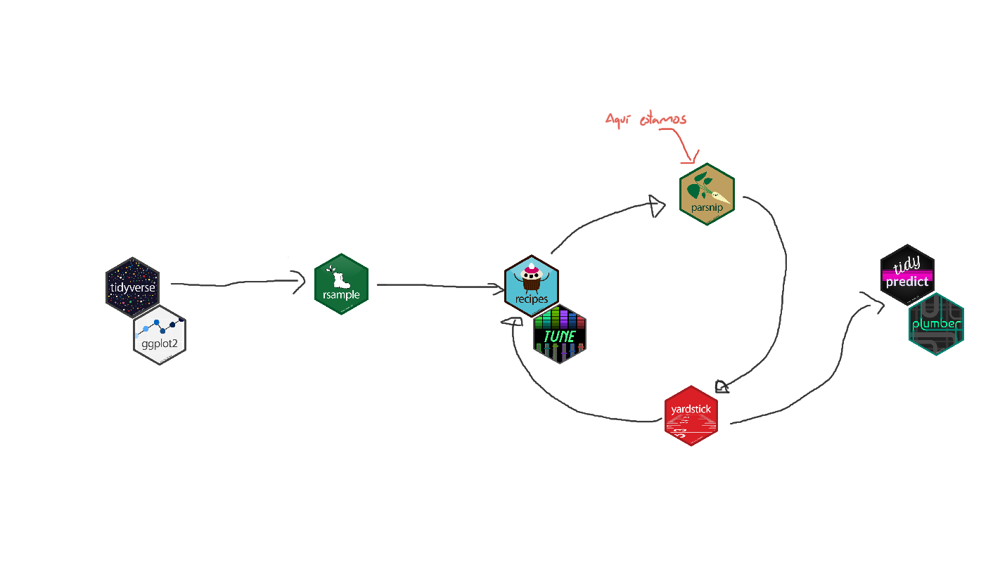
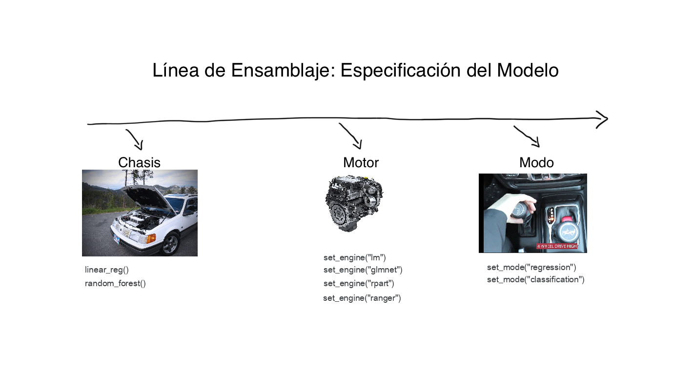

# Ajustando modelos con `parsnip`

**Objetivos de Aprendizaje:**

- Identificar formas en que **interfaces de modelos pueden diferir.**
- **Especificar un modelo** en `{parsnip}`.
- **Ajustar un modelo** con `parsnip::fit()` y `parsnip::fit_xy()`.
- Describir como `{parsnip}` **generaliza los argumentos de modelos.**
- Usar `broom::tidy()` para **convertir objetos de modelos en estructuras _tidy_.**
- Usar `dplyr::bind_cols()` y los métodos `predict()` de `{parsnip}` para **crear predicciones _tidy_.**
- **Encontrar interfaces a otros modelos** en paquetes adyacentes a `{parsnip}` (paquetes del universo `tidymodels`).

<details>
  <summary> Mapa de Modelado </summary>
  
  

- __Configuración para el capítulo__

```{r set-up-07, warning=FALSE, message=FALSE}
# cargar parsnip, recipes, rsample, broom...
library(tidymodels)
library(AmesHousing)

# cargar los datos
data(ames)

# aplicar el logaritmo base 10 a precio/price
ames <- dplyr::mutate(ames, Sale_Price = log10(Sale_Price))

# subconjuntos de entrenamiento y prueba
set.seed(123)
ames_split <- rsample::initial_split(ames, prob = 0.80, strata = Sale_Price)
ames_train <- rsample::training(ames_split)
ames_test  <- rsample::testing(ames_split)
```  

</details>


<br>

## Crear un modelo


### Diferentes Interfaces de Modelado

  


<br>

- Interfaces de Modelado
  - Diferentes Implementaciones = Diferentes Interfaces
  - _Regresión Lineal_ puede ser implementada en varias maneras
    - Mínimos Cuadrados Ordinarios (MCO) / _Ordinary Least Squares_
    - Regresión Lineal Regularizada / _Regularized Linear Regression_
    - ...

<br>

- __{stats}__
  - toma una fórmula
  - usa un `data.frame`

```{r lm-interface, eval=FALSE}
lm(formula, data, ...)
```

<br>


- __{glmnet}__ 
  - tiene una interfaz `x`/`y`
  - usa una matriz

```{r glmnet-interface, eval=FALSE}
glmnet(x = matrix, y = vector, family = "gaussian", ...)
```

<br>
<br>

### Especificación del Modelo



- __{tidymodels}/{parsnip}__ 
  - La idea es unificar y crear interfases más predecibles.
    - Especificar el tipo de modelo (e.g. regresión lineal, bosques aleatorios, ...)
      - `linear_reg()`
      - `rand_forest()`
    - Especificar el "motor" (i.e. paquete con la implementación del algoritmo)
      - `set_engine("paquete con la implementación")`
    - Especificar el modo (e.g. clasificación vs regresión lineal)
      - usa esto cuando el modelo puede ejecutar ambas clasificación y regresión lineal
      - `set_mode("regression")`
      - `set_mode("classification")`
    
  
<br>

- __Trayendo todo junto__

```{r model-spec}
lm_model_spec <- 
  parsnip::linear_reg() %>% # especificar el modelo
  parsnip::set_engine("lm") # especificar el motor


lm_model_spec
```


<br>
<br>


### Ajustando el Modelo

Usando la especificación de modelo previamente definida

<br>

- `fit()`
  - cualquier variable nominal o categórica será separada en _variables artificiales_
  - la _mayoría_ de métodos que usan una fórmula hacen esto mismo
<!-- - _most_ formula methods also turn do the same thing -->
- `fit_xy`
  - retrasa la creación de _variables artificiales_ y tiene una función de modelo subyacente
  

```{r model-fit}
# crear un ajuste de modelo usando una fórmula
lm_form_fit <- 
  lm_model_spec %>% 
  parsnip::fit(Sale_Price ~ Longitude + Latitude, data = ames_train)

# crear un ajuste de modelo usando x/y
lm_xy_fit <- 
  lm_model_spec %>% 
  parsnip::fit_xy(
    x = ames_train %>% dplyr::select(Longitude, Latitude),
    y = ames_train %>% dplyr::pull(Sale_Price)
  )
```

<br>
<br>


### Argumentos de Modelo Generalizados

- Como las interfases de modelo que varian, los parámetros de los modelos también varian de implementación a implementación
- Dos niveles de argumentos de modelos
  - __argumentos principales__ - Parámetros alineados con _vehículos matemáticos_
  - __argumentos de motor__ - Parámetros alineados con el paquete de implementación del algoritmo matemático


```{r package-param-comparisions, echo=FALSE}
tribble(
 ~argumento,     ~ranger,  ~randomForest, ~sparklyr,
  "predictores muestreados", "mtry",          "mtry",     "feature_subset_strategy",
  "árboles",                 "num.trees",     "ntree",    "num_trees",
  "observaciones a separar", "min.node.size", "nodesize", "min_instances_per_node"
) %>% 
  knitr::kable()
```

<br>


```{r parsnip-param-comparisions, echo=FALSE}
tribble(
 ~argumento,              ~parsnip,
  "predictores muestreados",  "mtry",  
  "árboles",                  "trees",
  "observaciones a separar",  "min_n"  
) %>% 
  knitr::kable()
```


<br>


<br>


+ La función `translate()` provee el mapeo desde la interfaz de `{parsnip}` a cada uno de los paquetes de implementación de los algoritmos. 
<!-- the mapping from the parsnips interface to the each individual package's implementation of the algorithm. -->

```{r model-package-differences}
# implementación de stats
parsnip::linear_reg() %>% 
  parsnip::set_engine("lm") %>% 
  parsnip::translate()


# implementación de glmnet
parsnip::linear_reg(penalty = 1) %>% 
  parsnip::set_engine("glmnet") %>% 
  parsnip::translate()
```


## Usar los resultados del Modelo

Ahora que ya hemos ajustado un modelo, vamos a necesitar extraer alguna información de resumen (i.e. métricas) de este, usaremos dos funciones extremadamente _divertidas_ del paquete `{broom}`: `tidy()` y `glance()`.

+ `tidy()` - Es muy versátil, aunque en nuestro contexto, solo va tomar nuestro objeto con el modelo y retornar los coeficientes de este en una `tibble`.

```{r broom-tidy}
broom::tidy(lm_form_fit) %>% 
  knitr::kable()
```

<br>

+ `glance()` - nos permite convertir el resumen de nuestro modelo en una `tibble`

```{r broom-glance}
broom::glance(lm_form_fit) %>% 
  knitr::kable()
```


## Haciendo Predicciones


- __Reglas para Vivir__:
  - Regresa una `tibble`
  - Los nombres de las columnas deben ser ... Predecibles
  - Regresa el mismo número de filas que las que hay en el set de datos de entrada
    - algunos métodos `predict()` omiten observaciones con valores faltantes, `NA`. Esto es genial si es el comportamiento deseado, en caso contrario, puede ser una pesadilla.


```{r predict-new-data}
# crear un ejemplo de set de prueba
ames_test_small <- ames_test %>% slice(1:5)

# predecir con este set
predict(lm_form_fit, new_data = ames_test_small) %>% 
  knitr::kable()
```

<br>

- Usando `dplyr::bind_cols` podemos combinar los resultados del método `predict()` con el set de prueba.

```{r combine-07}
# agregar predicciones con valores observados
ames_test_small %>%
  dplyr::select(Sale_Price) %>%
  dplyr::bind_cols(predict(lm_form_fit, ames_test_small)) %>%
  # Agregar el intervalo de confidencia para el 95%:
  dplyr::bind_cols(predict(lm_form_fit, ames_test_small, type = "pred_int")) %>% 
  knitr::kable()
```

## Paquetes Adjacentes a `{tidymodels}`

- Algunas opiniones pueden ser compartidas, otros paquetes de modelado pueden usar el mismo enfoque para replicar un flujo de trabajo. El paquete `{discrim}`^[Paquete Discrim [Enlace](https://github.com/tidymodels/discrim)] añade un nuevo arsenal de modelos matemáticos a nuestras herramientas/portafolio.
 - `discrim_flexible()` `%>%` - Modelo matemático (o el cuerpo del carro).
  - `set_engine("earth")` - El paquete que queremos usar para aproximar nuestro análisis.

```{r adjacent-packages, warning=FALSE, message=FALSE}
# devtools::install_github("tidymodels/discrim") # para instalar
# cargar el paquete
# library(discrim)

# crear datos artificiales
parabolic_grid <-
  expand.grid(X1 = seq(-5, 5, length = 100),
              X2 = seq(-5, 5, length = 100))

# ajustar el modelo usando discrim
fda_mod <-
  discrim::discrim_flexible(num_terms = 3) %>% 
  parsnip::set_engine("earth") %>%
  parsnip::fit(class ~ ., data = discrim::parabolic)

# asignar las predicciones al data frame
parabolic_grid$fda <-
  predict(fda_mod, parabolic_grid, type = "prob")$.pred_Class1

# graficar las predicciones
ggplot2::ggplot(discrim::parabolic, ggplot2::aes(x = X1, y = X2)) +
  ggplot2::geom_point(ggplot2::aes(col = class), alpha = .5) +
  ggplot2::geom_contour(data = parabolic_grid, aes(z = fda), 
                        col = "black", breaks = .5) +
  ggplot2::theme_bw() +
  ggplot2::theme(legend.position = "top") +
  ggplot2::coord_equal()
```


## Resumen

- __Crear una Interfaz Común__ 
  - Todos los modelos están compuestos por algunos componentes principales
    - modelos matemáticos
    - implementación de "motores"
    - modo si es requerido
    - Argumentos
      - Principal - especificación del algoritmo (árboles, número de atributos, penalización)
      - Motor - especificación del paquete/motor (e.g. verbose, num.threads, ...)
  - __Comportamiento Predictivo__
    - `tibble` como entrada, `tibble` como salida
    - igual número de observaciones regresadas por `predict()`

## Videos de las reuniones

### Cohorte 1

`r knitr::include_url("https://www.youtube.com/embed/Yz5I0UqlqbE")`

<details>
  <summary> Chat de la reunión </summary>

```
00:59:22	Esme:	https://www.statlearning.com/
01:06:43	Roberto Villegas-Diaz:	https://docs.google.com/spreadsheets/d/1apDY5yyimVUwebhZvTwM3P7Pysa9ztZvj4EUF_KFVdw/edit#gid=0
```
</details>
