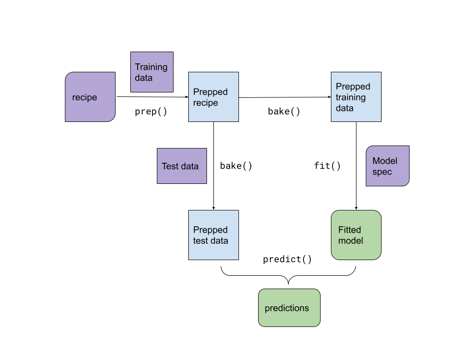

# A model workflow

**Learning objectives:**

- Explain why a **model workflow** includes preprocessing, fitting, and post-processing.
  - Describe parts of the modeling process that **occur before the model is fit.**
  - Describe parts of the modeling process that **occur after the model is fit.**
- Use the `{workflows}` package to **create a simple workflow.**
  - **Add a model** to a workflow.
  - **Add a formula** to a workflow.
  - **Fit** a workflow.
  - Use a workflow to **predict new data.**
  - **Update** a workflow.
- Use `{recipes}` with `{workflows}`.
  - **Add a recipe** to a workflow.
  - Use `workflows::pull_*()` to **extract objects from fitted workflows.**
- Describe how a workflow that uses a formula decides how to pre-process data.
  - Describe how workflows **using tree-based models** pre-process factor predictors.
  - **Add a special formula** to a workflow with the `formula` argument to `workflows::add_model()`.
- Describe workflow steps that are **not yet included** in `{tidymodels}`.

## Workflows

A single object to wrap the pre-processing and model fitting.



[Link to drawing](https://docs.google.com/drawings/d/1TbasFufN0y2vmj83Gn5u3IUx7Fsov0Ls3_Vqr6ns8FU/edit)

Workflows help you manage fewer objects and call fewer functions to achieve your goal.

## Demonstration

```{r setup-08, message=FALSE}
library(tidyverse)
library(tidymodels)
tidymodels_prefer()
set.seed(123)
```


A previous Tidy Tuesday dataset is used for demonstration. References:

- [Tidy Tuesday description](https://github.com/rfordatascience/tidytuesday/blob/master/data/2020/2020-01-28/readme.md)
- [Data source](https://data.sfgov.org/City-Infrastructure/Street-Tree-List/tkzw-k3nq)

```{r 08_read_sf_trees}
sf_trees <- readr::read_csv('https://raw.githubusercontent.com/rfordatascience/tidytuesday/master/data/2020/2020-01-28/sf_trees.csv')
kableExtra::kable(head(sf_trees, 10)) %>% kableExtra::scroll_box(width = '100%')
```

The goal will be to predict dbh which means diameter at breast height.

### Some data exploration and cleaning

```{r skim_sf_trees}
kableExtra::kable(skimr::skim(sf_trees)) %>% kableExtra::scroll_box(width = '100%')
# DataExplorer::create_report(sf_trees)
```


```{r sf_trees_cleaning}
trees_cleaned <- sf_trees %>%
  rename(diam = dbh, date_planted = date) %>%
  filter(!is.na(diam)) %>%
  filter(!is.na(legal_status)) %>%
  filter(latitude <= 40 & longitude >= -125) %>%
  filter(diam <= 100 & diam > 0) %>%
  filter(site_order >= 0) %>%
  select(-plot_size)

kableExtra::kable(skimr::skim(trees_cleaned)) %>% kableExtra::scroll_box(width = '100%')
```

```{r sf_trees_eda_plots}
ggplot(trees_cleaned, aes(x = diam)) +
  geom_histogram() +
  scale_x_log10()

ggplot(trees_cleaned, aes(x = date_planted, y = diam)) +
  geom_bin2d() +
  geom_smooth()
```

## Modeling with workflows

```{r common_modeling_setup_08}
trees_split <- initial_split(trees_cleaned %>% mutate(diam = log10(diam)), prop = 0.8)
trees_training <- training(trees_split)
trees_testing <- testing(trees_split)
```

```{r sf_trees_first_workflow}
trees_recipe <- recipe(trees_training, diam ~ .) %>%
  update_role(tree_id, address, new_role = "id") %>%
  step_indicate_na(date_planted) %>%
  # really dummy imputation
  step_mutate(date_planted = if_else(!is.na(date_planted), date_planted, as.Date('1950-01-01'))) %>%
  step_other(all_nominal_predictors(), threshold = 0.01) %>%
  step_dummy(all_nominal_predictors())

linear_model_spec <- linear_reg() %>% set_engine("lm")

tree_workflow_lm <- workflow() %>%
  add_model(linear_model_spec) %>%
  add_recipe(trees_recipe)
```

```{r sf_trees_fit_and_examine}
fitted_workflow_lm <- tree_workflow_lm %>% fit(trees_training)

tidy(extract_recipe(fitted_workflow_lm), 3)
tidy(extract_fit_parsnip(fitted_workflow_lm))
```

```{r sf_trees_predict_and_eval}
trees_testing$pred_lm <- predict(fitted_workflow_lm, trees_testing)$.pred

rmse(trees_testing, diam, pred_lm)
```

### Different model, same recipe

```{r sf_trees_rf_predict_and_eval}
rand_forest_spec <- rand_forest(
  mode = 'regression',
  mtry = 3,
  trees = 50,
  min_n = 10
) %>% 
  set_engine('ranger')

tree_workflow_rf <- tree_workflow_lm %>%
  update_model(rand_forest_spec)

fitted_workflow_rf <- tree_workflow_rf %>% fit(trees_training)

trees_testing$pred_rf <- predict(fitted_workflow_rf, trees_testing)$.pred

rmse(trees_testing, diam, pred_lm)
rmse(trees_testing, diam, pred_rf)
```


### Same model, different preprocessing

```{r sf_trees_formula}
formula_predictions <- tree_workflow_lm %>%
  remove_recipe() %>% 
  add_formula(diam ~ is.na(date_planted) + longitude) %>%
  fit(trees_training) %>%
  predict(trees_testing)

rmse_vec(trees_testing$diam, formula_predictions$.pred)
```

## Managing many workflows

```{r managing_many_workflows}
rand_forest_spec <- rand_forest(
  mode = 'regression',
  mtry = 2,
  trees = 25,
  min_n = 10
) %>% 
  set_engine('ranger')
tree_workflows <- workflow_set(
  preproc = list(
    "variables" = workflow_variables(diam, c(longitude, latitude, site_order)),
    "simple_formula" = diam ~ is.na(date_planted) + longitude + latitude,
    "trees_recipe" = trees_recipe
  ),
  models = list(
    "lm" = linear_model_spec,
    "rf" = rand_forest_spec
  )
)

tree_workflows
```

```{r using_workflow_sets}
tree_predictions <- tree_workflows %>%
  rowwise() %>%
  mutate(fitted_wf = list(fit(info$workflow[[1]], trees_training))) %>%
  mutate(pred = list(predict(fitted_wf, trees_testing)))

tree_predictions %>%
  mutate(rmse = rmse_vec(trees_testing$diam, pred$.pred))
```


## Notes

- how the formula is used will depend on the model specification
- If a modeling package uses the formula not only for pre-processing or has a syntax not supported by `model.matrix` you can specify a formula in `add_model`
- Later the `{workflows}` package will contain tools to help with post processing, such as creating hard predictions from class probabilities.


## Videos de las reuniones

### Cohorte 1

`r knitr::include_url("https://www.youtube.com/embed/URL")`

<details>
  <summary> Chat de la reunión </summary>
  
```
LOG
```
</details>
